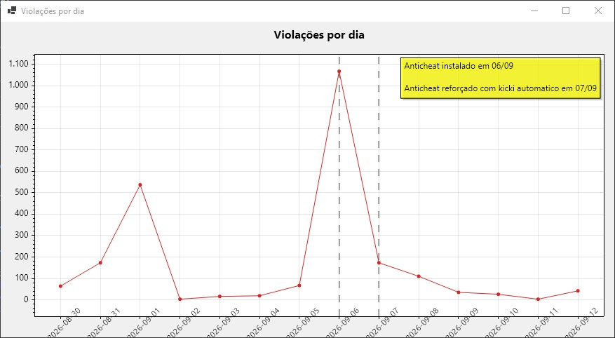

# Minecraft Community Data Analysis

A research project focused on collecting, organizing, and analyzing real data from a Minecraft Paper server.

The project uses data from server plugins and logs to better understand player activity, sessions, moderation actions, and anti-cheat violations.

## About

The main idea is to take raw data generated by a Minecraft server and turn it into structured data that can be analyzed more easily.

The project currently focuses on:

- Player activity and sessions
- Anti-cheat violations
- Moderation data
- Whitelist changes
- Database organization
- Server activity patterns
- Data quality and consistency

The data comes from a real Minecraft server and is collected through an API developed specifically for this project.

## ⚠️ Requirements

This project is a **standalone client** that visualizes data through a REST API. It does **not** work on its own — it depends on the backend from [`comunidade-minecraft-api`](https://github.com/ragaso62/comunidade-minecraft-api), which must be running locally (`http://localhost:8080`) before starting this application.

The backend is responsible for:
- Importing raw server data (SQLite → MySQL)
- Exposing the REST endpoints consumed by this project

Without it running, the application will fail with a connection/404 error on startup.

## Anti-Cheat Analysis

One of the current analyses uses data from GrimAC.

**Period:** 28/08/2026 – 12/09/2026

The graph shows the number of violations recorded each day:

The analysis shows two major spikes in violations, with the largest occurring on 06/09, reaching around 1060 violations. Most of this activity was concentrated on two players: `ninja_br1` and `_pret0`.

After enabling an automatic kick at 30 violations, the number of violations dropped significantly. Notably, this measure did not remove the players from the server — it appears to have discouraged the behavior itself, suggesting the drop reflects an actual behavioral change rather than data being cut off.

However, the total number of violations alone does not show the full picture.

| Player | Total Violations | Average Level | Peak |
|---|---:|---:|---:|
| ninja_br1 | 1176 | 923 | 3143 |
| _pret0 | 875 | 118 | 771 |

Even though the total number of violations is relatively similar, their intensity is very different — `ninja_br1` shows far fewer but much more severe violations on average, while `_pret0` shows more frequent but milder ones.

**Open question:** total violation count alone cannot determine which player represents the greater actual risk. Because of this, a future analysis will test metrics that combine the **number and intensity of violations** (e.g. `total × average level`) instead of relying only on the raw count.

## Data Quality

The project also looks at the quality of the collected data.

The analysis is based on the ideas presented by:

> Wang, R. Y., & Strong, D. M. (1996). *Beyond Accuracy: What Data Quality Means to Data Consumers.*

The study is used as a reference for evaluating aspects such as accuracy, consistency, and usefulness of the collected data.

DOI: `10.1080/07421222.1996.11518099`

## Technologies

- Java
- Maven
- MySQL
- SQLite
- Paper
- GrimAC
- AuthMe
- REST API
- C# / WinForms / ScottPlot

## Project Structure

The project is divided into different parts responsible for collecting, importing, organizing, and analyzing the server data.

The imported data is stored in a relational database, allowing different types of server information to be connected and queried.

## Goals

The main goals of the project are:

1. Collect real server data.
2. Organize it into a relational database.
3. Analyze player and server activity.
4. Identify recurring patterns.
5. Evaluate anti-cheat data.
6. Test different ways of measuring suspicious behavior.
7. Evaluate the quality and usefulness of the collected data.

## Status

🚧 Research project in progress.

The database structure, data importer, and initial analyses are already being developed. More metrics and analyses will be added as the project progresses.
